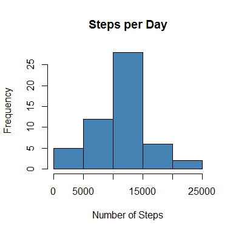
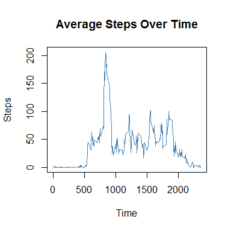
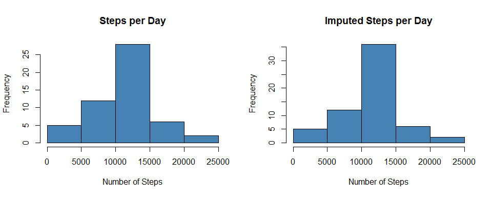

# Reproducible Research: Peer Assessment 1


## Loading and preprocessing the data

The data comes from 
[this git repository](https://github.com/rdpeng/RepData_PeerAssessment1), 
from the activity.zip file.

```r
activities <- read.csv(unzip('activity.zip'))
```

## What is mean total number of steps taken per day?


```r
library('plyr')
steps <- ddply(activities, .(date), summarize, steps_per_day=sum(steps))
hist(steps$steps_per_day, main='Steps per Day', 
        xlab='Number of Steps', col='steelblue')
```



The mean number of steps per day.

```r
mean(steps$steps_per_day, na.rm = TRUE)
```

```
## [1] 10766.19
```

The median number of steps per day.

```r
median(steps$steps_per_day, na.rm = TRUE)
```

```
## [1] 10765
```

## What is the average daily activity pattern?


```r
steps_per_interval <- ddply(activities, .(interval), summarize, 
                            steps_per_interval=mean(steps, na.rm=TRUE))
plot(steps_per_interval$interval, steps_per_interval$steps_per_interval, 
     type='l', main='Average Steps Over Time', xlab='Time', ylab='Steps', 
     col='steelblue')
```



5 minute interval with the greatest number of average steps:

```r
subset(steps_per_interval, steps_per_interval==max(steps_per_interval))
```

```
##     interval steps_per_interval
## 104      835           206.1698
```

## Imputing missing values

The number of NA values.

```r
sum(is.na(activities$steps))
```

```
## [1] 2304
```
head(activities) shows some missing values

```r
head(activities)
```

```
##   steps       date interval
## 1    NA 2012-10-01        0
## 2    NA 2012-10-01        5
## 3    NA 2012-10-01       10
## 4    NA 2012-10-01       15
## 5    NA 2012-10-01       20
## 6    NA 2012-10-01       25
```
Impute the missing values by assigning them to the average for that interval
across all days.

```r
imputed <- activities
for (i in 1:length(imputed$steps))
    if (is.na(imputed$steps[i]))
        imputed$steps[i] = 
        steps_per_interval$steps_per_interval[imputed$interval[i] == 
                                                  steps_per_interval$interval]
head(imputed)
```

```
##       steps       date interval
## 1 1.7169811 2012-10-01        0
## 2 0.3396226 2012-10-01        5
## 3 0.1320755 2012-10-01       10
## 4 0.1509434 2012-10-01       15
## 5 0.0754717 2012-10-01       20
## 6 2.0943396 2012-10-01       25
```

```r
imputed_steps <- ddply(imputed, .(date), summarize, steps_per_day=sum(steps))
par(mfrow=c(1,2))
hist(steps$steps_per_day, main='Steps per Day', 
        xlab='Number of Steps', col='steelblue')
hist(imputed_steps$steps_per_day, main='Imputed Steps per Day', 
        xlab='Number of Steps', col='steelblue')
```


The histogram has changed very little, indicating that imputing values using
the average interval value was a sound strategy.

```r
mean(steps$steps_per_day, na.rm=TRUE)
```

```
## [1] 10766.19
```

```r
mean(imputed_steps$steps_per_day)
```

```
## [1] 10766.19
```

```r
median(steps$steps_per_day, na.rm=TRUE)
```

```
## [1] 10765
```

```r
median(imputed_steps$steps_per_day)
```

```
## [1] 10766.19
```
The all but identical values for mean and median support this conclusion.  

## Are there differences in activity patterns between weekdays and weekends?


```r
with_weekdays <- imputed
with_weekdays$weekday <- ifelse(weekdays(as.Date(with_weekdays$date)) == 
                                'Saturday' | 
                                weekdays(as.Date(with_weekdays$date)) == 'Sunday', 
                                'weekend', 'weekday')
with_weekdays$weekday <- as.factor(with_weekdays$weekday)
head(with_weekdays)
```

```
##       steps       date interval weekday
## 1 1.7169811 2012-10-01        0 weekday
## 2 0.3396226 2012-10-01        5 weekday
## 3 0.1320755 2012-10-01       10 weekday
## 4 0.1509434 2012-10-01       15 weekday
## 5 0.0754717 2012-10-01       20 weekday
## 6 2.0943396 2012-10-01       25 weekday
```

```r
interval_weekday <- ddply(with_weekdays, .(interval, weekday), summarize, 
                          steps=mean(steps))
library(lattice)
xyplot(steps ~ interval | weekday, data=interval_weekday, type='l', layout=c(1,2))
```


  
There's a spike at about 800 that exists for weekdays but not weekends.
